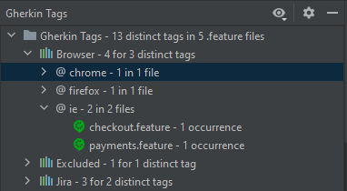

# Gherkin Overview

[](https://plugins.jetbrains.com/plugin/16716-gherkin-overview)

<!-- Plugin description -->
This JetBrains IDE plugin helps to better visualize the structure of test projects incorporating .feature files, for Cucumber and similar frameworks,
from the perspective of Gherkin tags.

The plugin can be useful in cases like the ones below:
- to see what Gherkin tags are used throughout a project
- to track the progress of test migrations, e.g. between modules
- for Gherkin tags assigned an issue management related category, the plugin can provide a sort of test traceability
<!-- Plugin description end -->

The core idea is to provide a better overview of what Gherkin tags are available in a project, what Gherkin files they are contained by,
and with grouping tags into categories, make them easier to search.

It collects all .feature files from an open project, regardless of what BDD framework is used, and visualizes it in a custom tool window.

## Preconditions

Before installing this plugin, make sure to install the plugin called [**Gherkin**](https://plugins.jetbrains.com/plugin/9164-gherkin) as well, if it's not already installed.

To work with JBehave Story files, the [**JBehave Support**](https://plugins.jetbrains.com/plugin/7268-jbehave-support) plugin must be installed.

## Support for different BDD syntax

For common Gherkin files, this readme provides information, while for JBehave Stories (introduced in v0.2.0),
you can head over to the [JBehave Story support](docs/jbehave-stories_en.md) document.

## Gherkin Tags tool window

This is a custom tool window that displays the Gherkin tags, associated Gherkin files and related categories in a tree view, in the layouts detailed below.

**Without any grouping, showing data from the overall project**
```
Gherkin Tags                        <-- Root node. It is permanent
    Test Suite                      <-- A Category of tags
        smoke                       <-- Gherkin tag
            homepage_smoke.feature  <-- A .feature file
        regression
            search_page.feature
        e2e
            landing_page.feature
    Device
        desktop
            landing_page.feature
        mobile
            search_page.feature
    ...
```

**Grouping by modules in the project**
```
Gherkin Tags                            <-- Root node. It is permanent
    Module                              <-- A project module in the IDE
        Test Suite                      <-- A Category of tags
            smoke                       <-- Gherkin tag
                homepage_smoke.feature  <-- A .feature file
            regression
                search_page.feature
            e2e
                landing_page.feature
    Module-2
        Device
            desktop
                landing_page.feature
            mobile
                search_page.feature
        ...
```

| No grouping                                                                | Grouping by modules                                    |
|----------------------------------------------------------------------------|--------------------------------------------------------|
|  |  |

In case a project doesn't have .feature/.story files, or it has some but there is no Gherkin tag used, the tool window simply displays the following message: *There is no Gherkin tag in this project.*

A **Category** is a group associated to tags. An @e2e and @regression tag may be associated with the Test Suite category, @Safari might be added to a category called Browser. It provides additional grouping in the tool window for easier search.

### Catch-all groups

Though some tags are assigned by default to certain categories on the application (IDE) level, and they can be further configured, there will still be tags that are not assigned to any category. For this purpose there is a permanent catch-all category to which tags, that are not assigned to any other category, will be assigned to.

In case the tool window's contents are not grouped by content roots, there on such category, while in case of grouping by content roots, each content root has its own **Other** category.

A similar logic is applied to content roots as well, where the catch-all content root is called **Rootless**, in case
a file is not part of any IDE content root. The difference here is that this root is not permanent, so if there is no Gherkin file that is place out of any content root, this group is not displayed.

### Statistics

In addition to the tree view itself, the nodes can display extra statistics about the number of Gherkin files, tags and tag occurrence counts.

This extra information can be enabled/disabled under the  toolbar menu. They display the following data:

| Node types           | Simplified stat.                                                                                | Detailed stat.                                                                                                                   | Notes                                                                                                                                                                                                                                    |
|----------------------|-------------------------------------------------------------------------------------------------|----------------------------------------------------------------------------------------------------------------------------------|------------------------------------------------------------------------------------------------------------------------------------------------------------------------------------------------------------------------------------------|
| Project/Content root | *X tags, Y .feature files*<br/>*X metas, Y .story files*<br/>*X items, Y .feature/.story files* | *X distinct tags in Y .feature files*<br/>*X distinct metas in Y .story files*<br/>*X distinct items in Y .feature/.story files* | X: number of distinct tags in the project/content root<br>Y: number of feature files in the project/content root that actually contain tags. The overall number of .feature files in the project/content root may be the same or higher. |
| Category             | *(X)*                                                                                           | *X for Y distinct tags*                                                                                                          | X: number of occurrences of all tags under this category in the associated project/content root                                                                                                                                          |
| Tag                  | *(X)*                                                                                           | *X in Y files*                                                                                                                   | X: number of occurrences of this tag in the associated project/content root                                                                                                                                                              |
| Feature              | *(X)*                                                                                           | *X occurrence*                                                                                                                   | X: number of occurrences of the parent tag in this file                                                                                                                                                                                  |
|                      |                                       |                                                                            |                                                                                                                                                                                                                                          |

### Search in the tree view

To make search easier in the tool window, you can simply start typing your keyword, and the tree view will highlight all matching, visible nodes, the same way search works in the IDE Project view.

### Locate tags

An action, similar to the Project View's 'Select Opened File' one, is available on the tool window's toolbar.
It locates and selects the Tag node of a Gherkin Tag that is under the caret in the currently selected text editor.
Upon selection, the tool window is focused and can be interacted with using the keyboard.

The toolbar button is disabled for JBehave Story metas for now, or when there is more than one caret placed in the current editor.

This feature is meant to help find out what other Gherkin files use the same, selected tag, and provides a simpler, more focused view of this information,
than a plain text search of the tag's text would.

### Tool window updates

Since changes can and do happen in the files and folders in the project, changes are reflected in the Tags tool window as well.

The tool window UI (and the underlying model) is updated when a Gherkin/Story file's content has changed, or the file has be removed,
in every other case (e.g. file rename, Git revert, folder copy, ...) the whole model is rebuilt from scratch, also collapsing the UI tree.

### Context menu actions

Since v1.2.0, a context menu action is available on Tag nodes. It can delete all occurrences of the selected tag/meta from all affected files.

NOTE: minor formatting adjustments might be necessary after using this action.


## Settings

Within `Settings > Tools > Gherkin Overview` there are additional customization options.

Gherkin tags can be mapped to existing or new categories based on which the tool window will display them, meaning you can
define the Gherkin tags that your test projects actually use, to tailor them to your needs.

There are two levels of such mappings: application and project.

Application-level mappings are applied to all open projects in the IDE, while project-level mappings override application-level
ones, and are applied only to the current project. This way, if you have multiple test projects, you can customize the mappings, so that they can use common mappings as well as their own project specific ones.

The plugin comes with a [default set of application-level mappings](src/main/resources/mapping/default_app_level_mappings.properties) that can be modified any time.

In the settings panel you can find a customizable table for both levels.

The lists of tags that are assigned to given categories can be specified as comma separated lists of strings. Under the hood
tags are stored without the leading @ symbol, so make sure the tag values here are specified without them. This makes
the UI less cluttered, and it is easier to specify them this way.

If you happen to make a mistake during configuration, there is a **Reset to default** option that resets the application-level mappings to the aforementioned default set.

### Using project-level mappings

To use the project-level ones, first you have to check the **Use project level category-tag mapping** checkbox.

To better understand how application and project-level values are merged and handled, you can find a few examples here:

| Application                        | Project                              | Final, merged mapping                                          |
|------------------------------------|--------------------------------------|----------------------------------------------------------------|
| Test Suite -> smoke,regression,e2e |                                      | Test Suite -> smoke,regression,e2e                             |
|                                    | Device -> mobile,desktop             | Device -> mobile,desktop                                       |
| Test Suite -> smoke,regression,e2e | Device -> mobile,desktop             | Test Suite -> smoke,regression,e2e<br>Device -> mobile,desktop |
| Test Suite -> smoke,regression,e2e | Test Suite -> regression,healthcheck | Test Suite -> smoke,regression,e2e,healthcheck                 |
| Test Suite -> smoke,regression,e2e | Test Pack -> e2e                     | Test Suite -> smoke,regression<br>Test Pack -> e2e             |

**NOTE:** mapping the same tag (either explicit ones, or regex based tags with overlapping match results) to multiple different categories
should be avoided as it may cause weird issues in the tool window's tree view.

### Collecting Gherkin tags from the current project

Defining your own mappings is quite useful, but it would still be quite a hassle to collect all the distinct Gherkin tags from your project
to be able to map them.

The bottom section of the plugin's settings page is aimed to help with that. Once IDE finished indexing, just click on the  button. Once it's done, it shows you the tags separated into categories.
If a tag is already mapped to a category, then it is shown accordingly, so you don't necessarily have to deal with their categorization, otherwise unmapped tags are put into
a single table cell.

When there is indexing in progress, and you hit the button, you get a message saying .

If the collection cannot start when there is no apparent indexing still ongoing, there might be additional indexing queued up by the IDE that will happen when the Settings window is closed. In that case reopening the settings can help mitigate the problem.

### Regex values

Beside exact tag values, regex patterns can also be bound to categories. Their values have to start with a hashmark (#).
That symbol identifies that the value has to be treated as a regex pattern.

One example is available in the application level mappings for Jira ticket identifiers: `#^[A-Z]+-[0-9]+$`.

One or more such patterns can be assigned to a category. A category can be assigned exact tag values and regex patterns as well, in a mixed manner.

## Distinguishing multiple Gherkin files with the same name

It may be a rare case, but it is still possible that a project contains more than one Gherkin file with the same name, even containing
at least some of the same tags.

In that case, .feature files named for instance `homepage_smoke.feature` would be displayed as:

```
- @Smoke
    - homepage_smoke.feature
    - homepage_smoke.feature
    - homepage_smoke.feature
```

That is not really helpful. To help differentiate between those files, the following mechanism is implemented:
- if the first Feature keyword's text is different in each of these files, then those values are displayed, e.g.:

```
- @Smoke
    - homepage_smoke.feature [Generic smoke test]
    - homepage_smoke.feature [Homepage analytics smoke]
    - homepage_smoke.feature [Homepage search smoke]
```

This may be an indicator that you need to give more descriptive names to your .feature files.

But, if Feature names are not distinct, then instead they are differentiated by their relative paths to the project's
root folder:

```
- @Smoke
    - homepage_smoke.feature [aModule/src/main/resources/features]
    - homepage_smoke.feature [/]  <-- It means, the file is located in the project's root.
    - homepage_smoke.feature [another/folder]
```

## Export / Import

Since v0.3.0, application-level category-tags mappings can be exported via the IDE's **Export Settings...** dialog, along with other plugin and IDE settings.

## Licensing

This project is licensed under the terms of Apache Licence Version 2.0.

## Acknowledgements

A special thank you to [Limpek07](https://github.com/Limpek07) for the many brainstorming sessions, ideas and testing efforts.
