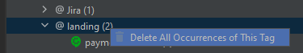
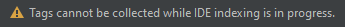

# Gherkin Overview

A bővítmény alapötlete, hogy jobb átláthatóságot adjon arról, egy projektben milyen Gherkin tag-ek vannak, azok mely fájlokban
vannak használva, illetve a tag-ek kategóriákba sorolásával segítse azok könnyebb kereshetőségét.

A használt BDD keretrendszertől függetlenül összegyűjti az egy projektben létező minden .feature fájlt,
amiket aztán egy egyedi tool window-ban jelenít meg.

## Előfeltételek

A bővítmény telepítése előtt szükséges a [**Gherkin**](https://plugins.jetbrains.com/plugin/9164-gherkin) bővítmény telepítése is, ha még nem lenne.

A JBehave Story fájlok támogatásához szükséges a [**JBehave Support**](https://plugins.jetbrains.com/plugin/7268-jbehave-support) bővítmény telepítése.

## Különféle BDD szintaxisok támogatása

A Gherkin fájlokkal kapcsolatos információkat e dokumentum részletezi, míg a JBehave Story-kat (v0.2.0 óta) a [JBehave Story support](docs/jbehave-stories_hu.md)
dokumentum.

## Gherkin Tags tool window

Ez egy egyedi tool window, ami a Gherkin tag-eket, az őket tartalmazó Gherkin fájlokat, és a kapcsolódó kategóriákat egy fa nézetben jeleníti meg,
a lent részletezett elrendezésben.

**Csoportosítás nélkül, a teljes projektben elérhető adatokat megjelenítve**
```
Gherkin Tags                        <-- A fa legkülső, állandó pontja
    Test Suite                      <-- Tag-ek egy kategóriája
        smoke                       <-- Gherkin tag
            homepage_smoke.feature  <-- Egy .feature fájl
        regression
            search_page.feature
        e2e
            landing_page.feature
    Device
        desktop
            landing_page.feature
        mobile
            search_page.feature
    ...
```

**Csoportosítás a projekt moduljai alapján**
```
Gherkin Tags                            <-- A fa legkülső, állandó pontja
    Module                              <-- A projekt egy modulja
        Test Suite                      <-- Tag-ek egy kategóriája
            smoke                       <-- Gherkin tag
                homepage_smoke.feature  <-- Egy .feature fájl
            regression
                search_page.feature
            e2e
                landing_page.feature
    Module-2
        Device
            desktop
                landing_page.feature
            mobile
                search_page.feature
        ...
```

| Csoportosítás nélkül                                                       | Csoportosítás modulonként                              |
|----------------------------------------------------------------------------|--------------------------------------------------------|
|  |  |

Ha egy projekt nem tartalmaz .feature/.story fájlt, vagy tartalmaz, de nincs bennük tag használva, a tool window-ban a következő felirat jelenik meg:
*There is no Gherkin tag in this project*.

Egy **Kategória** egy tag-ekhez rendelt csoportot jelent. Egy @e2e és @regression tag tartozhat egy Test Suite,
míg a @Safari a Browser kategóriához. Ez a fajta csoportosítás egyszerűbb keresést biztosít a tool window-ban.

### Közös csoportok

Habár bizonyos tag-ek már telepítéskor kategóriákhoz vannak rendelve az alkalmazás (IDE) szintjén,
és azok még tovább konfigurálhatók, lesznek egyetlen kategóriához sem rendelt tag-ek is.
Erre az esetre lett létrehozva egy állandó kategória, hogy legyen hol megjeleníteni a kategóriához nem tartozó tag-eket.

Ha a tool window tartalmára nincs csoportosítás kiválasztva, akkor egyetlen ilyen kategória jelenik meg Other névvel,
míg a content root-ok szerinti csoportosítás esetén minden content root-hoz megjelenik a saját **Other** nevű kategóriája.

Hasonló logika érvényes az olyan fájlokra, amelyek nem tartoznak egy content root-hoz sem, ezek a közös **Rootless** nevű kategóriában jelennek meg.
A különbség annyi, hogy ha nincs content root-hoz nem tartozó Gherkin fájl, a Rootless kategória nem jelenik meg.

### Statisztika

A fa nézeten felül, a csomópontok további statisztikai adatokat is képesek megjeleníteni a Gherkin fájlok számát,
és a tag-ek számát és előfordulásukat illetően.

Ez ez extra információ az eszköztár  ikonjával kapcsolható ki/be, és az alábbi adatokat jeleníti meg:

| Csomópont típusok    | Egyszerűsített statisztika                                                                      | Részletes statisztika                                                                                                            | Notes                                                                                                                                                                                                                                    |
|----------------------|-------------------------------------------------------------------------------------------------|----------------------------------------------------------------------------------------------------------------------------------|------------------------------------------------------------------------------------------------------------------------------------------------------------------------------------------------------------------------------------------|
| Project/Content root | *X tags, Y .feature files*<br/>*X metas, Y .story files*<br/>*X items, Y .feature/.story files* | *X distinct tags in Y .feature files*<br/>*X distinct metas in Y .story files*<br/>*X distinct items in Y .feature/.story files* | X: number of distinct tags in the project/content root<br>Y: number of feature files in the project/content root that actually contain tags. The overall number of .feature files in the project/content root may be the same or higher. |
| Category             | *(X)*                                                                                           | *X for Y distinct tags*                                                                                                          | X: number of occurrences of all tags under this category in the associated project/content root                                                                                                                                          |
| Tag                  | *(X)*                                                                                           | *X in Y files*                                                                                                                   | X: number of occurrences of this tag in the associated project/content root                                                                                                                                                              |
| Feature              | *(X)*                                                                                           | *X occurrence*                                                                                                                   | X: number of occurrences of the parent tag in this file                                                                                                                                                                                  |
|                      |                                       |                                                                            |                                                                                                                                                                                                                                          |

### Keresés a fában

Hogy a tool window-ban történő keresés egyszerűbb legyen, csak kezdd el írni a keresett kifejezést.
A fában ekkor, az IDE Projekt nézetéhez hasonlóan, kijelölésre kerül minden vele egyező, és látható, csomópont.

### Tag-ek kijelölése

Elérhető egy, a Project View 'Select Opened File' műveletéhez hasonló, művelet a tool window eszköztárán.
Ez segít behatárolni és kijelölni egy Gherkin tag-hez tartozó Tag elemet a tool window-ban. Ehhez szükséges,
hogy a kurzor egy Gherkin tag elemre legyen helyezve az aktív szerkesztőben. A kijelölés után a tool window önmaga is fókuszt kap,
így azonnal lehetséges a billentyűzettel műveleteket végezni benne.

A művelethez tartozó gomb nincs engedélyezve JBehave Story meták esetén, és amikor több mint 1 kurzor van
elhelyezve az aktív szerkesztőben.

Ez a funkció annak kiderítésében hivatott segíteni, hogy egy adott tag milyen más Gherkin fájlokban fordul még elő.
Ezzel egy egyszerűbb és áttekinhetőbb nézetet kapnak a felhasználók ahhoz képest, mintha egyszerű, szövegalapú keresést végeznének a tag nevével.

### A tool window tartalmának frissítése

A projektfájlokban és -mappákban történő változásokat a tool window-ban megjelenített adatok is követik és tükrözik.

A tool window adatai (az alsóbb szintű adatmodell) és a grafikus felület azonnal, szimplán frissítésre kerül,
amint egy Gherkin/Story fájl megváltozik, vagy a fájl törlésre kerül. Minden más esetben
(pl. fájl átnevezése, Git revert, mappa másolása, ...), a teljes adatmodell újjáépül, a fa nézet pedig összecsukódik.

### Helyi menü lehetőségek

Az 1.2.0 verzió óta elérhető egy helyi menü opció a Tag csomópontokon. Ez törli a kiválasztott tag/meta összes előfordulásátt az összes érintett fájlból.

Megjegyzés: az érintett fájlok további kisebb formázása szükséges lehet az opció használata után.



## Beállítások

A `Settings > Tools > Gherkin Overview` alatt további testreszabási lehetőségek érhetőek el.

A Gherkin tag-ek hozzárendelhetőek már létező vagy új kategóriákhoz, amik alapján a tool window megjeleníti őket.
Így csoportokba szervezheted a projektedben ténylegesen használt tag-eket, hogy a saját igényeidre szabd őket.

Ezek két szinten vannak jelen: alkalmazás és projekt.

Az alkalmazás szintű hozzárendelések minden megnyitott projektre érvényesek, míg a projekt szintűek felülírják
az alkalmazás szintűeket, és csak az épp aktuális projektre érvényesek. Így oly módon lehetséges testreszabni őket,
hogy több teszt projekt esetén mindegyik használni tudja az alkalmazás szintűeket és a saját projektjéhez tartozó értékeket is.

A bővítmény telepítése után elérhető az [alkalmazás szintű hozzárendelések egy kezdő szettje](src/main/resources/mapping/default_app_level_mappings.properties),
amelyek bármikor módosíthatóak.

A beállítások panelen mind a két szintre elérhető egy-egy testreszabható táblázat.

Egy adott kategóriához rendelt tag-ek listája elemek vesszővel elválasztott felsorolásaként adható meg.
A bővítmény a tag-eket a kezdő @ karakter nélkül tárolja, ezért fontos, hogy a tag-eket a @ nélkül szükséges megadni.
Ennek köszönhetően a felület kevésbé zsúfolt, illetve könnyebb őket megadni.

Ha valamilyen hibát vétenél a konfigurálás közben, a **Reset to default** gombbal alaphelyzetbe állíthatóak az alkalmazás szintű hozzárendelések.

### Projekt szintű hozzárendelések

A projekt szintű beállításokhoz először a **Use project level category-tag mapping** dobozt kell bepipálni.

Azt, hogy hogyan vannak a különböző szintű hozzárendelések összefésülve és kezelve, az alábbi példák mutatják be:

| Alkalmazás                         | Projekt                              | Végső, összefésült hozzárendelések                             |
|------------------------------------|--------------------------------------|----------------------------------------------------------------|
| Test Suite -> smoke,regression,e2e |                                      | Test Suite -> smoke,regression,e2e                             |
|                                    | Device -> mobile,desktop             | Device -> mobile,desktop                                       |
| Test Suite -> smoke,regression,e2e | Device -> mobile,desktop             | Test Suite -> smoke,regression,e2e<br>Device -> mobile,desktop |
| Test Suite -> smoke,regression,e2e | Test Suite -> regression,healthcheck | Test Suite -> smoke,regression,e2e,healthcheck                 |
| Test Suite -> smoke,regression,e2e | Test Pack -> e2e                     | Test Suite -> smoke,regression<br>Test Pack -> e2e             |

**Megjegyzés:** ugyanazon tag (legyen az konkrét tag név alapján, vagy regex alapú tag-ek egymást átfedő eredményekkel)
több különböző kategóriához történő hozzárendelését érdemes elkerülni, mert furcsa megjelenítési problémákat okozhat a tool window-ban.

### Az aktuális projektben előforduló Gherkin tag-ek összegyűjtése

Saját hozzárendelések készítése kifejezetten hasznos, de segítség nélkül még mindig problémás lehet
összegyűjteni egy projektben előforduló összes Gherkin tag-et, hogy aztán kategóriákba rendezhessük őket.

A beállítások panel alsó szekciója ebben hivatott segíteni. Amikor az IDE befejezte az indexelést, kattints a  gombra!
Amikor a művelet befejeződött, az összegyűjtött tag-eket kategóriába rendezve fogja megjeleníteni.
Ha egy tag már hozzá van rendelve egy kategóriához, akkor az aszerint jelenik meg, így nem feltétlen szükséges foglalkozni azok kategorizálásával.
Egyébként, a kategóriához nem rendelt tag-ek egy közös cellában jelennek meg.

Ha a gombra kattintáskor egy indexelés épp folyamatban van, a következő üzenet jelenik meg: 

Ha a tag-ek összegyűjtése nem kezdődik el annak ellenére, hogy látszólag nem történik indexelés, lehetséges,
hogy a háttérben az IDE már sorbaállított több indexelési feladatot, amik akkor fognak lefutni,
amikor a Settings ablak bezáródik. Ilyenkor a beállítások újranyitása megoldhatja a problémát.

### Regex értékek

Konkrét tag-ek mellett reguláris kifejezések is megadhatók a kategóriákban. Ezek értékei kettőskereszttel (#) kell, hogy kezdődjenek.

Egy példa erre az alkalmazás szintű értékek esetén a Jira jegy azonosítók: `#^[A-Z]+-[0-9]+$`.

Egy vagy több ilyen kifejezés is megadható egy adott kategóriában. Egy kategóriához pedig tag nevek és reguláris kifejezések vegyesen is hozzárendelhetőek.

## Több megegyező nevű Gherkin fájl megkülönböztetése

Bár valószínűleg ritka eset, de lehetséges, hogy egy projektben ugyanazzal a névvel több fájl is létezik, akár több közös tag-et is tartalmazva.

Ebben az esetben a pl. `homepage_smoke.feature` nevű fájlok így jelennének meg:

```
- @Smoke
    - homepage_smoke.feature
    - homepage_smoke.feature
    - homepage_smoke.feature
```

Ez nem igazán hasznos, így ezen fájlok megkülönböztetésére a következő logika lett implementálva.

Ha az első Feature kulcsszó szövege különbözik ezekben a fájlokban, akkor ez a szöveg jelenik meg, pl.:

```
- @Smoke
    - homepage_smoke.feature [Generic smoke test]
    - homepage_smoke.feature [Homepage analytics smoke]
    - homepage_smoke.feature [Homepage search smoke]
```

Ez jelezheti azt is, hogy ezeknek a .feature fájloknak beszédesebb neveket kellene adni.

Ha viszont a Feature nevek megegyeznek, akkor a projekt gyökeréhez viszonyított relatív útvonallal vannak megkülönböztetvE:

```
- @Smoke
    - homepage_smoke.feature [aModule/src/main/resources/features]
    - homepage_smoke.feature [/]  <-- A fájl a projekt gyökerében található.
    - homepage_smoke.feature [another/folder]
```

## Export / Import

A 0.3.0 verzió óta az alkalmazás szintű hozzárendelések kiexportálhatók az IDE **Export Settings...** ablakában,
további bővítmények és az IDE beállításaival együtt.

## Licenszelés

A projektre az Apache Licence Version 2.0 licensz érvényes.

## Köszönetnyilvánítás

Külön köszönet illeti [Limpek07](https://github.com/Limpek07)-et a sok agyviharzós szeánsz, az ötletei és a tesztelési segítség kapcsán.